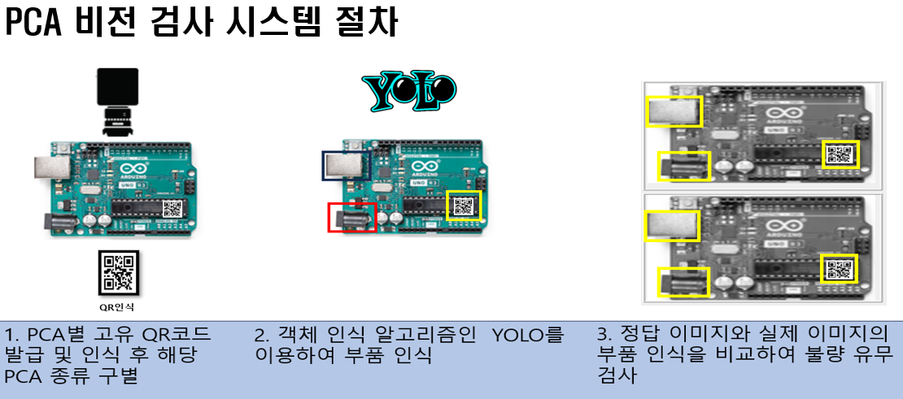
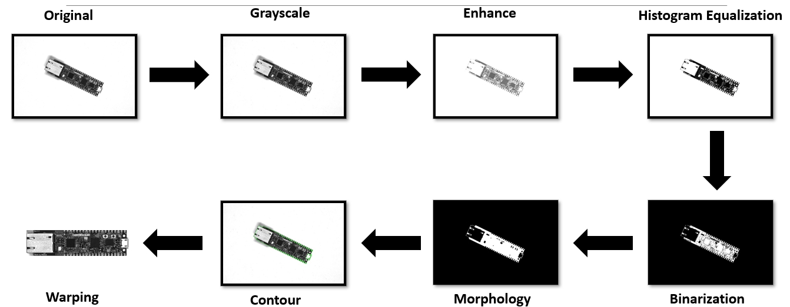
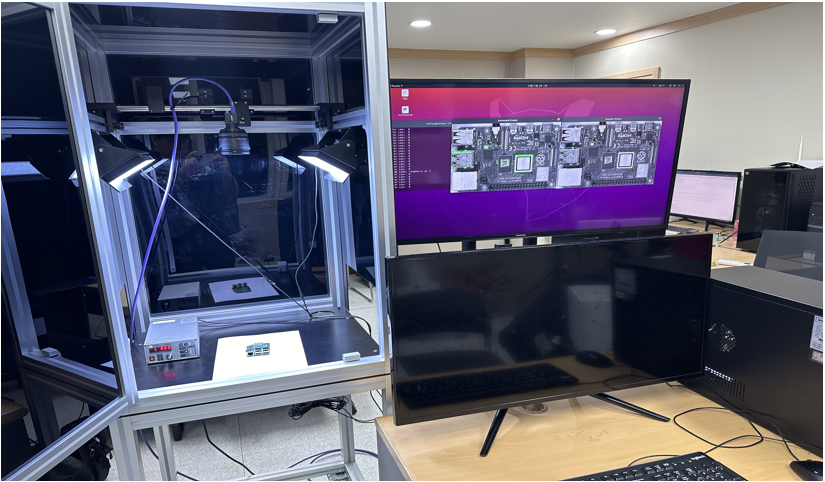
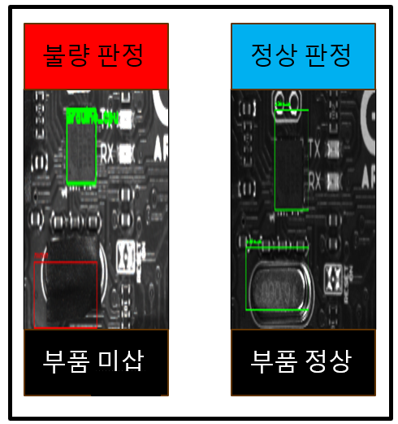
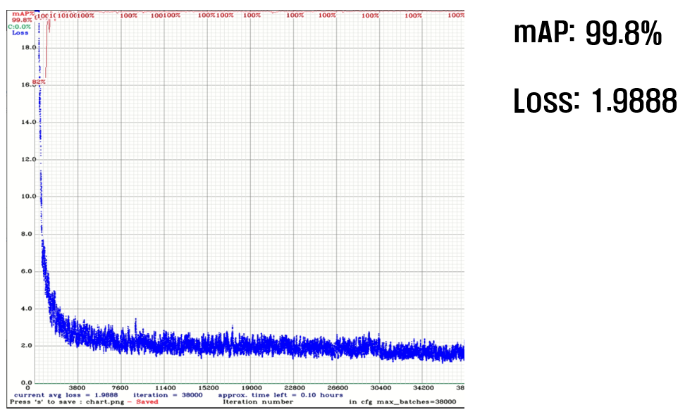
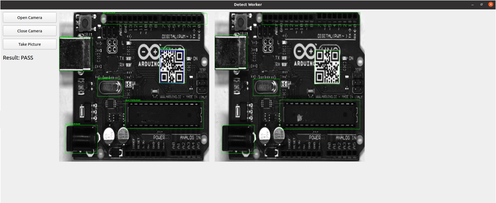

# pca_vision_system
이 프로젝트는 딥러닝 영상 인식을 이용한 PCA 비전 검사 시스템입니다.

## Main Function
    - PCA 종류 구분
    - PCA 부품 미삽 판별

##  System Specifications
OS: Ubuntu 20.04  
YOLO: V4  
OpenCV: 4.5.0  
Cuda: 12.0.0  
Cudnn: 8.9.0  
Camera SDK: [SDK 다운로드 링크](https://www.hikrobotics.com/en/machinevision/service/download/)

## Project Structure
```
pca_vision_system/
├── yolo_test/backup/pca_system.weights  # YOLOv4 모델 파일 (별도로 다운로드 필요)
├── yolo_test/data/obj.data              # YOLOv4 모델 데이터 설정 파일 (별도로 다운로드 필요)
├── yolo_test/data/obj.names             # YOLOv4 모델 클래스 이름 파일 (별도로 다운로드 필요)
├── yolo_test/yolo-obj.cfg               # YOLOv4 모델 설정 파일 (별도로 다운로드 필요)
├── pca_system.py                        # 메인 PCA 검사 시스템 파일
├── warping.py                           # PCA 이미지 warping 파일
├── all_warping.py                       # 모든 PCA 이미지 한번에 warping 파일
├── answers                              # 정답 이미지와 부품의 좌표
├── image                                # 시각적 자료
└── README.md                            # 프로젝트 문서
```
## Usage
 1. 저장소를 클론하세요:
   ```bash
   mkdir pca_vision_system
   git clone https://github.com/dlalstjd0513/pca_vision_system.git
   cd pca_vision_system
  ```
 2. Google Drive에서 모델 파일('pca_system.weights')을 다운로드한 후, 프로젝트 디렉토리에 배치하세요:
   [pca_system.weights 다운로드](https://drive.google.com/drive/folders/1fdI0GUPcIlD-0MqyfcjGb_iCTmjt74aF?usp=drive_link)
 
 3. 비전 시스템을 실행하세요:
    ```bash
    실행 전 path는 맞게 설정 후 실행
    python pca_system.py
    ```

## YOLO MODEL information
 'pca_system.weights'파일은 PCA 부품 감지를 위한 사전 학습된 YOLOv4 모델을 포함합니다. 애플리케이션을 실행하기 전에 반드시 다운로드하세요.

## H/W information
Camera_Model: Hikirobot-MV-CE200-11UM  
Light_Model: (주)이룸인더스트리-Esmart 제어기 시리즈

## 해당 시스템 절차

## 이미지 전처리 과정

## 하드웨어 구성

## 판별 내용

## yolo 결과

## 최종 결과


### 참고 사항
- YOLOv4 모델을 효율적으로 실행하려면 GPU와 같은 필수 하드웨어가 필요합니다.
- 문제가 발생하면 저장소의 이슈 탭에 문의하세요.